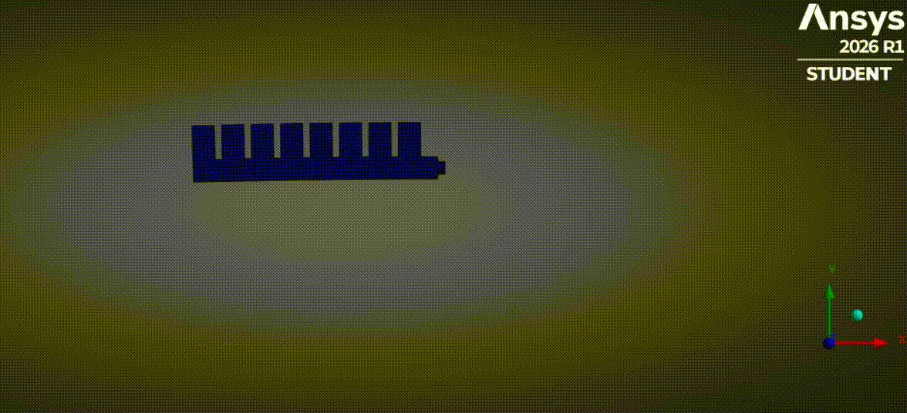
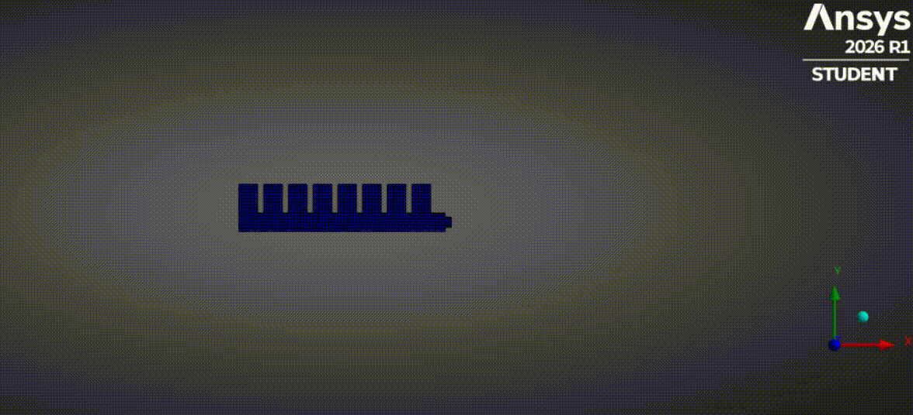
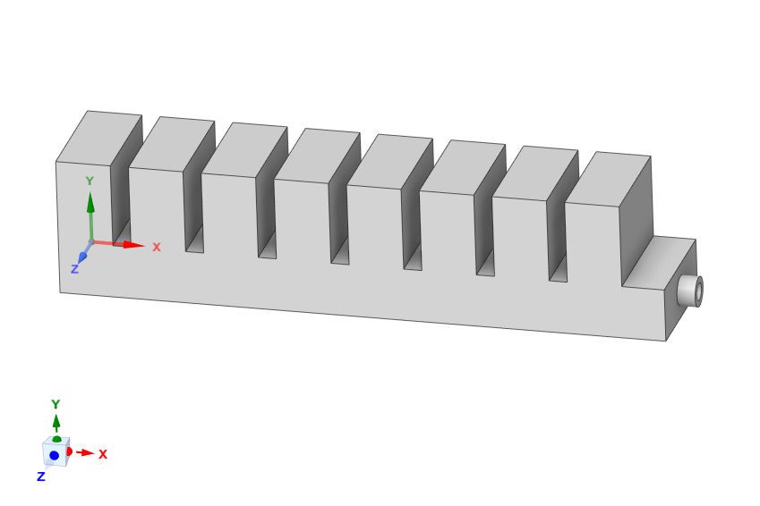
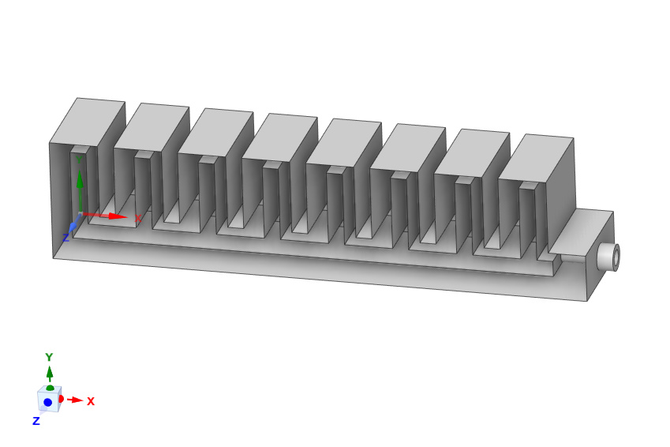
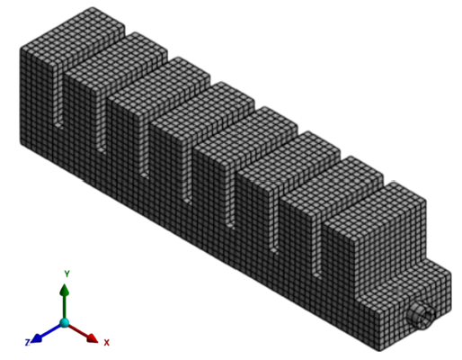
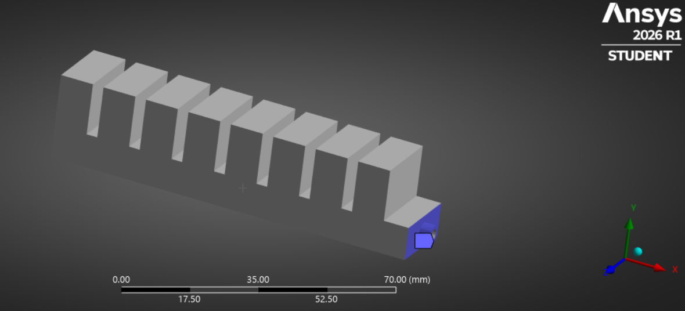
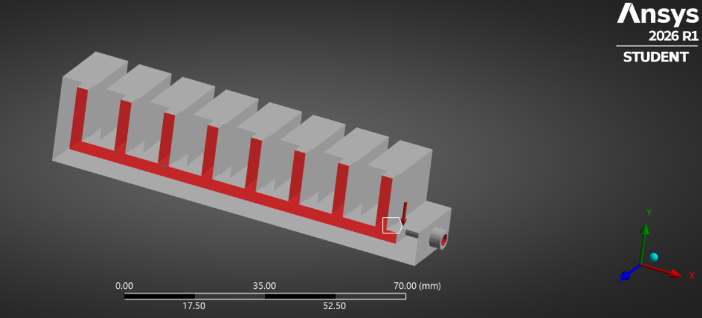
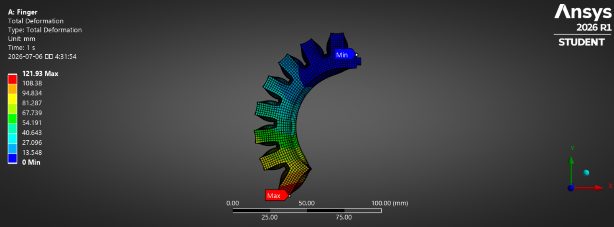
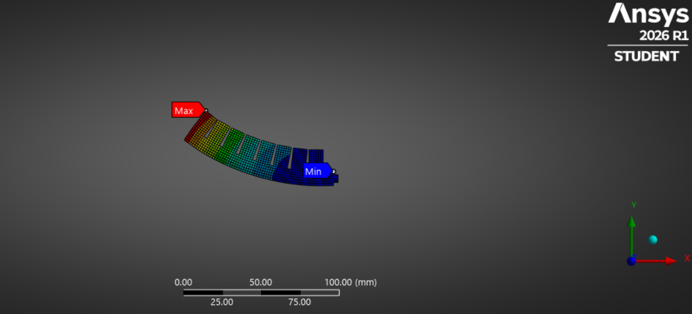

# Hyperelastic Soft Finger Simulation
### ANSYS-based deformation analysis of a bellows-type soft actuator

## Overview

  
  

## Motivation

Human fingers are not composed only of rigid bone structures.  
The parts that directly interact with objects are covered with skin and soft tissue, which behave more like elastic materials.

Based on this idea, future humanoid robot hands may combine rigid skeletal structures with elastic outer layers.  
This project was conducted to understand the deformation behavior of a hyperelastic soft finger structure.

## Simulation Setup

- Tool: ANSYS Workbench
- Model: Bellows Type Soft Finger
- Material: Hyperelastic Polymer
- Material Model: Dragon Skin 30 / Yeoh 3rd Order
- Boundary Condition: Fixed Support
- Load Condition: Time-dependent Internal Pressure

| Loading Case | t = 1 s | t = 2 s | t = 3 s |
|---|---:|---:|---:|
| Negative-to-Positive Pressure | -10 kPa | 20 kPa | 50 kPa |
| Positive-to-Negative Pressure | 50 kPa | 20 kPa | -10 kPa |

The material was defined as a hyperelastic polymer using the Yeoh 3rd Order model for Dragon Skin 30.  
The pressure conditions were applied as time-dependent internal pressure values.

## Modeling Process

  
  
  

A simplified bellows-type finger model was created for the simulation.  
An internal chamber was modeled inside the finger so that pneumatic pressure could be applied, and an inlet hole was added at the end of the structure.  
A **Hex Dominant mesh** was applied to generate a mesh that follows the bellows finger geometry while using mostly hexahedral elements.

## Boundary Conditions

  
  

The base region was fixed to represent the condition where the finger is attached to a palm or frame.  
Pneumatic pressure was applied uniformly to the internal chamber wall faces.

## Result

  
  

The initial expectation was that negative and positive pressure would bend the finger in opposite directions.  
However, the simulation showed that negative pressure mainly caused the chamber to contract, while positive pressure caused the chamber to expand and generate a clear bending deformation.

This means that the bending direction does not simply reverse according to the pressure sign.  
Instead, the deformation behavior is determined by the contraction and expansion of the internal chamber.

Since the analysis was performed using Static Structural with Tabular Data, the result represents the equilibrium deformation at each pressure step rather than a true dynamic time response.

## Conclusion

This project analyzed the pneumatic deformation behavior of a hyperelastic bellows-type soft finger.  
The results showed that negative pressure mainly produced chamber contraction, while positive pressure generated bending deformation through chamber expansion.

Through this simulation, I confirmed that soft robotic finger structures require consideration of material nonlinearity and geometry-dependent deformation, unlike rigid-body-based robotic mechanisms.
